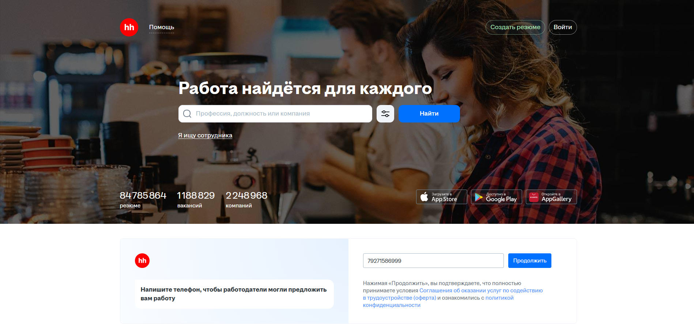

# Автотесты для сайта hh.ru

[hh.ru](https://hh.ru/)

## Особенности проекта

- Запуск web UI автотестов в Selenoid
- Сборка проекта в Jenkins
- Отчеты Allure Report
- Оповещения о тестовых прогонах в Telegram
- Отчеты с видео, скриншотом, логами, исходной моделью разметки страницы

## Список проверок, реализованных в web UI автотестах

 Выбор города
 

 Поиск работы
 

 Поиск резюме
 

 Поиск компании
 

 Проверка выполненых задач
 

## Список проверок, реализованных API tests:

 Выбор города

 Поиск работы

 Поиск резюме

 Успешная авторизацияn

## Список проверок, реализованных mobile tests:

 Успешная авторизация
 

 Неуспешная авторизация

 Проверка резюме

 Сообщение в тех.поддержку

## Используемый стэк

## Запуск тестов из терминала
### Для запуска всех автотестов выполнить в cli:
> python -m venv .venv  
> source .venv/bin/activate   
> pip install -r requirements.txt   
> pytest .

### Получение отчета allure:
> allure serve allure-results
> 
> 
## Проект в Jenkins
[Jekins](https://jenkins.autotests.cloud/job/hh_python_project/)

### Запуск автотестов в Jenkins:
1. Открыть [проект](https://jenkins.autotests.cloud/job/hh_python_project/)
2. Build with Parameters 
3. Нажать кпопку Build 

<h2 id="run-tests"> Run tests</h2>

<b>For web tests:</b>

<pre>
    pytest tests/web
</pre>

<b>For API tests:</b>

<pre>
    pytest tests/api
</pre>

<b>For mobile tests on emulator:</b>

<pre>
    pytest tests/mobile --context=local_emulator
</pre>

<b>For mobile tests on real device:</b>

<pre>
    pytest tests/mobile --context=real_local
</pre>

<b>For mobile tests on bstack:</b>

<pre>
    pytest tests/mobile --context=bstack
</pre>

### [Allure отчет](https://jenkins.autotests.cloud/job/hh_python_project/29/allure/)

### [Результат прохождения теста Allure TestOps](https://allure.autotests.cloud/project/4299/dashboards)

<h2 id="telegram-notification">Оповещения в Telegram </h2>

## [Видео прохождения автотестов](https://selenoid.autotests.cloud/video/93ce3d0fe17922d2d1efc4071cda460d.mp4) 

## [Видео прохождение автотестов в мобильной версии](https://app-automate.browserstack.com/sessions/b3d62e0db045e959bb26dd668defc6d081ca2f51/video?token=YzJLVjFKVXNRRTNyQ1g5OEVldk5BdUE5NCtBOHdJSWtqcHQvNzluQk1CamRKRm8yTmNlTm56N2hib0xlc2svS0JYZFVpTFovNzFKTlVnSWRndzNZeHc9PS0teVhzQUhXVzVpUHY2NklYUTI5Sy9UUT09--95eeee272e828880de2260c22359b8ccab0d8203&source=rest_api&diff=1.044777313) 

 